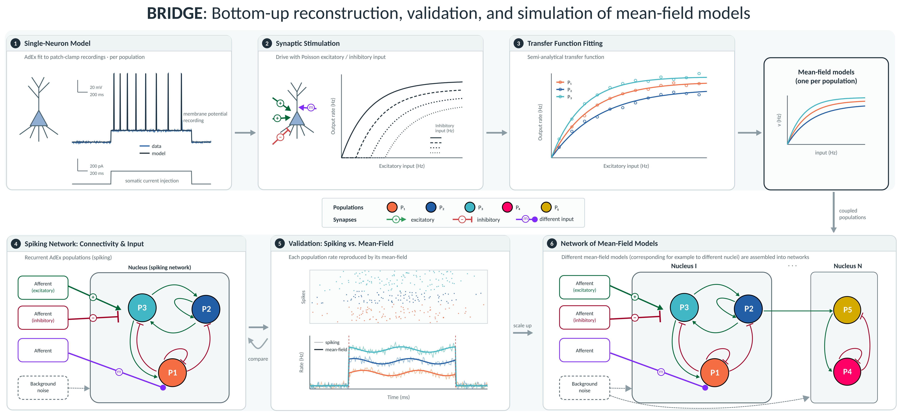

# BRIDGE

**A Computational Workflow from Single Neurons to Network of Mean-Field Models**

This repository accompanies the manuscript *"BRIDGE: A Computational Workflow from
Single Neurons to Network of Mean-Field Models"* (in preparation). It provides an
open-source Python pipeline for the **bottom-up reconstruction and validation of
mean-field (MF) models** directly from single-neuron electrophysiology.

The workflow proceeds in stages:

1. **Single-neuron characterisation** — fit spiking neuron models (AdEx) to
   experimental spike features and characterise their input–output behaviour.
2. **Spiking-network generation** — build the spiking neural network with recurrent connections.
3. **Transfer-function derivation** — generate transfer-function (TF) data
   from spiking simulations and fit a semi-analytical TF for each population.
4. **Mean-field model** — assemble the fitted TFs into a mean-field model and validate
   it against ground-truth spiking-network simulations.
5. **Network of mean-fields** — couple validated mean-field nodes into networks of
   interacting populations.